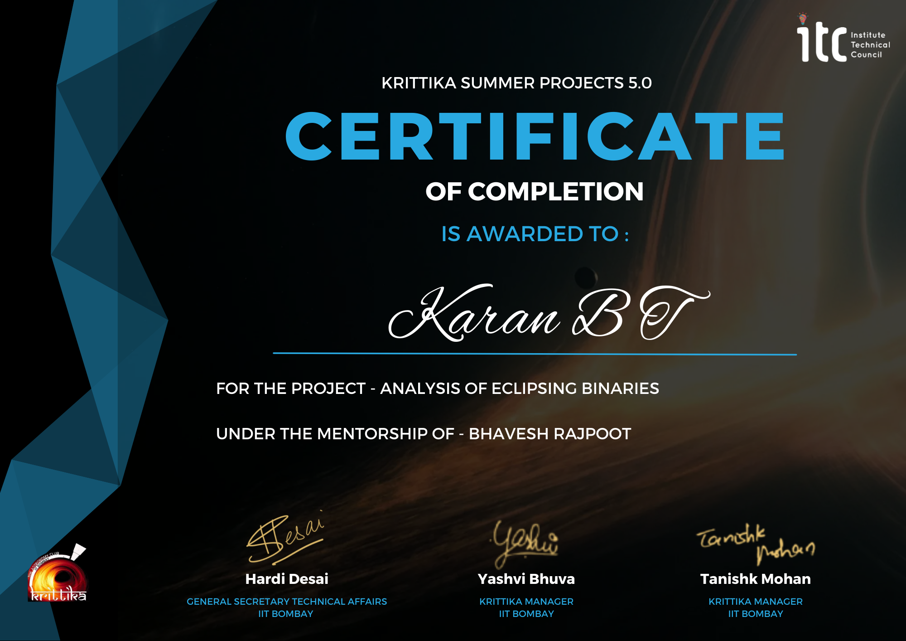

# EB-Modeling

This repository aims to recreate the eclipsing binary star system **KIC 2306740** using the PHOEBE (PHysics Of Eclipsing BinariEs) software. The goal is to derive the system's parameters accurately from observational data, including light curves and radial velocity curves.

This project is part of the Krittika Summer Projects 5.0 ✨, organized by Krittika, the astronomy club of IIT Bombay

---
## Beginning guidelines
There are several pathways by which you can proceed with this repository.

1. Complete Novice to Eclipsing Binaries and PHOEBE:
   - Begin by checking the presentation, [KSP_5.0-EBs.pdf](KSP_5.0-EBs.pdf).
   - For more details, refer to the report, []().
   - Proceed with the [notebooks](notebooks)
  
2. Know Eclipsing Binaries but not PHOEBE:
   - Begin by checking the paper, [Physics of Eclipsing Binaries. V. General Framework for Solving the Inverse Problem](https://iopscience.iop.org/article/10.3847/15384365/abb4e2)
   - Then proceed with the [notebooks](notebooks)
  
3. Familiar with PHOEBE and Eclipsing Binaries:
   - Begin directly with the [notebooks](notebooks) 

Once you decide on your pathway, follow these steps to set up the environment before running the notebook:

```
https://github.com/karanbt/EB-modeling.git
cd EB-Modeling
```
```
conda env create --file=environment.yml
conda activate EB-Modeling
```

This project is under continuous development, with potential updates introducing new methodologies or validation tests. To stay informed about these updates, consider clicking the "Watch" button in the top right.

For contributing to this project and repository, please see [collaboration.md](collaboration.md)

---
## References 
  
### Papers

1. [Physics of Eclipsing Binaries. V. General Framework for Solving the Inverse Problem](https://iopscience.iop.org/article/10.3847/1538-4365/abb4e2) by Kyle E. Conroy et al 2020
2. [The Nature of the Eccentric Double-lined Eclipsing Binary System KIC 2306740 with Kepler Space Photometry](https://iopscience.iop.org/article/10.3847/1538-4357/abe546) by D. Koçak et al 2021
   
### Packages
1. NumPy, SciPy, AstroPy, Matplotlib, PHOEBE

## Course Certificate


